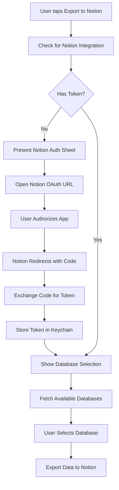

# iOS Implementation Specification: Notion Export + v2 Features

## Executive Summary

This document provides comprehensive technical specifications for implementing Notion Export functionality (Priority #1) and v2 features (Holding Cost, CRM Funnel, Inventory Metrics) on iOS. Based on the existing Android implementation analysis.

---

## 1. NOTION EXPORT ARCHITECTURE (PRIORITY #1)

### 1.1 Overview

The Notion Export feature allows dealers to export their vehicle inventory, leads, and sales data to Notion databases where they can apply custom formulas and analysis.

### 1.2 Authentication Flow



### 1.3 Notion API Integration

#### OAuth Configuration

```swift
// NotionConfig.swift
struct NotionConfig {
    static let clientId = "YOUR_NOTION_CLIENT_ID"
    static let clientSecret = "YOUR_NOTION_CLIENT_SECRET"
    static let redirectUri = "ezcar24://notion/callback"
    
    static var authUrl: URL {
        var components = URLComponents(string: "https://api.notion.com/v1/oauth/authorize")!
        components.queryItems = [
            URLQueryItem(name: "client_id", value: clientId),
            URLQueryItem(name: "redirect_uri", value: redirectUri),
            URLQueryItem(name: "response_type", value: "code"),
            URLQueryItem(name: "owner", value: "user")
        ]
        return components.url!
    }
}
```

#### Token Storage (Keychain)

```swift
// NotionTokenManager.swift
import Security

class NotionTokenManager {
    static let shared = NotionTokenManager()
    private let keychainKey = "com.ezcar24.notion.token"
    
    func saveToken(_ token: String) -> Bool {
        let data = token.data(using: .utf8)!
        let query: [String: Any] = [
            kSecClass as String: kSecClassGenericPassword,
            kSecAttrAccount as String: keychainKey,
            kSecValueData as String: data
        ]
        SecItemDelete(query as CFDictionary)
        return SecItemAdd(query as CFDictionary, nil) == errSecSuccess
    }
    
    func getToken() -> String? {
        let query: [String: Any] = [
            kSecClass as String: kSecClassGenericPassword,
            kSecAttrAccount as String: keychainKey,
            kSecReturnData as String: true
        ]
        var result: AnyObject?
        SecItemCopyMatching(query as CFDictionary, &result)
        guard let data = result as? Data else { return nil }
        return String(data: data, encoding: .utf8)
    }
    
    func deleteToken() {
        let query: [String: Any] = [
            kSecClass as String: kSecClassGenericPassword,
            kSecAttrAccount as String: keychainKey
        ]
        SecItemDelete(query as CFDictionary)
    }
}
```

### 1.4 Data Mapping to Notion Properties

#### Vehicle Export Schema

| App Field | Notion Property Type | Notion Property Name | Notes |
|-----------|---------------------|---------------------|-------|
| vin | title | VIN | Primary identifier |
| make | rich_text | Make | |
| model | rich_text | Model | |
| year | number | Year | Integer |
| purchasePrice | number | Purchase Price | Currency (AED) |
| purchaseDate | date | Purchase Date | |
| status | select | Status | owned, sold |
| salePrice | number | Sale Price | Currency (AED), nullable |
| saleDate | date | Sale Date | Nullable |
| askingPrice | number | Asking Price | Currency (AED) |
| daysInInventory | formula | Days in Inventory | `dateBetween(now(), prop("Purchase Date"), "days")` |
| totalExpenses | number | Total Expenses | Sum of all expenses |
| holdingCost | number | Holding Cost | Calculated |
| totalCost | formula | Total Cost | `prop("Purchase Price") + prop("Total Expenses") + prop("Holding Cost")` |
| roi | formula | ROI % | `((prop("Sale Price") - prop("Total Cost")) / prop("Total Cost")) * 100` |
| profit | formula | Profit | `prop("Sale Price") - prop("Total Cost")` |
| agingBucket | select | Aging Bucket | 0-30, 31-60, 61-90, 90+ |

#### Lead Export Schema

| App Field | Notion Property Type | Notion Property Name | Notes |
|-----------|---------------------|---------------------|-------|
| name | title | Name | |
| phone | phone_number | Phone | |
| email | email | Email | |
| leadStage | select | Stage | new, contacted, qualified, negotiation, offer, test_drive, closed_won, closed_lost |
| leadSource | select | Source | facebook, dubizzle, instagram, referral, walk_in, phone, website, other |
| estimatedValue | number | Estimated Value | Currency (AED) |
| priority | number | Priority | 0-5 |
| leadScore | number | Lead Score | 0-100 |
| lastContactDate | date | Last Contact | |
| nextFollowUpDate | date | Next Follow-up | |
| createdAt | date | Created | |

### 1.5 Notion API Service

```swift
// NotionAPIService.swift
import Foundation

class NotionAPIService {
    static let shared = NotionAPIService()
    private let baseURL = "https://api.notion.com/v1"
    private let notionVersion = "2022-06-28"
    
    private var token: String? {
        NotionTokenManager.shared.getToken()
    }
    
    private var headers: [String: String] {
        [
            "Authorization": "Bearer \(token ?? "")",
            "Notion-Version": notionVersion,
            "Content-Type": "application/json"
        ]
    }
    
    // MARK: - Database Operations
    
    func fetchDatabases() async throws -> [NotionDatabase] {
        guard let token = token else {
            throw NotionError.notAuthenticated
        }
        
        let url = URL(string: "\(baseURL)/search")!
        var request = URLRequest(url: url)
        request.httpMethod = "POST"
        request.allHTTPHeaderFields = headers
        request.httpBody = try JSONSerialization.data(withJSONObject: [
            "filter": ["value": "database", "property": "object"]
        ])
        
        let (data, _) = try await URLSession.shared.data(for: request)
        let response = try JSONDecoder().decode(NotionSearchResponse.self, from: data)
        return response.results.compactMap { $0 as? NotionDatabase }
    }
    
    func createVehicleDatabase(parentPageId: String) async throws -> NotionDatabase {
        let url = URL(string: "\(baseURL)/databases")!
        var request = URLRequest(url: url)
        request.httpMethod = "POST"
        request.allHTTPHeaderFields = headers
        
        let schema: [String: Any] = [
            "parent": ["page_id": parentPageId],
            "title": [["text": ["content": "Vehicle Inventory"]]],
            "properties": [
                "VIN": ["title": [:]],
                "Make": ["rich_text": [:]],
                "Model": ["rich_text": [:]],
                "Year": ["number": ["format": "number"]],
                "Purchase Price": ["number": ["format": "dollar"]],
                "Purchase Date": ["date": [:]],
                "Status": [
                    "select": [
                        "options": [
                            ["name": "owned", "color": "green"],
                            ["name": "sold", "color": "blue"]
                        ]
                    ]
                ],
                "Sale Price": ["number": ["format": "dollar"]],
                "Sale Date": ["date": [:]],
                "Asking Price": ["number": ["format": "dollar"]],
                "Days in Inventory": [
                    "formula": [
                        "expression": "dateBetween(now(), prop(\"Purchase Date\"), \"days\")"
                    ]
                ],
                "Total Expenses": ["number": ["format": "dollar"]],
                "Holding Cost": ["number": ["format": "dollar"]],
                "Total Cost": [
                    "formula": [
                        "expression": "prop(\"Purchase Price\") + prop(\"Total Expenses\") + prop(\"Holding Cost\")"
                    ]
                ],
                "ROI %": [
                    "formula": [
                        "expression": "((prop(\"Sale Price\") - prop(\"Total Cost\")) / prop(\"Total Cost\")) * 100"
                    ]
                ],
                "Profit": [
                    "formula": [
                        "expression": "prop(\"Sale Price\") - prop(\"Total Cost\")"
                    ]
                ],
                "Aging Bucket": [
                    "select": [
                        "options": [
                            ["name": "0-30", "color": "green"],
                            ["name": "31-60", "color": "yellow"],
                            ["name": "61-90", "color": "orange"],
                            ["name": "90+", "color": "red"]
                        ]
                    ]
                ]
            ]
        ]
        
        request.httpBody = try JSONSerialization.data(withJSONObject: schema)
        let (data, _) = try await URLSession.shared.data(for: request)
        return try JSONDecoder().decode(NotionDatabase.self, from: data)
    }
    
    func exportVehicles(_ vehicles: [VehicleExportData], to databaseId: String) async throws -> ExportResult {
        var successCount = 0
        var failedVehicles: [String] = []
        
        for vehicle in vehicles {
            do {
                try await createVehiclePage(vehicle, databaseId: databaseId)
                successCount += 1
            } catch {
                failedVehicles.append(vehicle.vin)
            }
        }
        
        return ExportResult(
            successCount: successCount,
            failedCount: failedVehicles.count,
            failedIdentifiers: failedVehicles
        )
    }
    
    private func createVehiclePage(_ vehicle: VehicleExportData, databaseId: String) async throws {
        let url = URL(string: "\(baseURL)/pages")!
        var request = URLRequest(url: url)
        request.httpMethod = "POST"
        request.allHTTPHeaderFields = headers
        
        let properties: [String: Any] = [
            "parent": ["database_id": databaseId],
            "properties": [
                "VIN": ["title": [["text": ["content": vehicle.vin]]]],
                "Make": ["rich_text": [["text": ["content": vehicle.make ?? ""]]]],
                "Model": ["rich_text": [["text": ["content": vehicle.model ?? ""]]]],
                "Year": ["number": vehicle.year as Any],
                "Purchase Price": ["number": NSDecimalNumber(decimal: vehicle.purchasePrice).doubleValue],
                "Purchase Date": ["date": ["start": ISO8601DateFormatter().string(from: vehicle.purchaseDate)]],
                "Status": ["select": ["name": vehicle.status]],
                "Sale Price": vehicle.salePrice.map { ["number": NSDecimalNumber(decimal: $0).doubleValue] } as Any,
                "Sale Date": vehicle.saleDate.map { ["date": ["start": ISO8601DateFormatter().string(from: $0)]] } as Any,
                "Asking Price": vehicle.askingPrice.map { ["number": NSDecimalNumber(decimal: $0).doubleValue] } as Any,
                "Total Expenses": ["number": NSDecimalNumber(decimal: vehicle.totalExpenses).doubleValue],
                "Holding Cost": ["number": NSDecimalNumber(decimal: vehicle.holdingCost).doubleValue],
                "Aging Bucket": ["select": ["name": vehicle.agingBucket]]
            ]
        ]
        
        request.httpBody = try JSONSerialization.data(withJSONObject: properties)
        let (_, response) = try await URLSession.shared.data(for: request)
        
        guard let httpResponse = response as? HTTPURLResponse,
              (200...299).contains(httpResponse.statusCode) else {
            throw NotionError.exportFailed
        }
    }
}

// MARK: - Supporting Types

enum NotionError: Error {
    case notAuthenticated
    case exportFailed
    case invalidResponse
    case databaseNotFound
}

struct ExportResult {
    let successCount: Int
    let failedCount: Int
    let failedIdentifiers: [String]
}

struct VehicleExportData {
    let vin: String
    let make: String?
    let model: String?
    let year: Int32
    let purchasePrice: Decimal
    let purchaseDate: Date
    let status: String
    let salePrice: Decimal?
    let saleDate: Date?
    let askingPrice: Decimal?
    let totalExpenses: Decimal
    let holdingCost: Decimal
    let agingBucket: String
}
```

### 1.6 UI Components

```swift
// NotionExportView.swift
import SwiftUI

struct NotionExportView: View {
    @StateObject private var viewModel = NotionExportViewModel()
    
    var body: some View {
        NavigationView {
            Form {
                Section("Authentication") {
                    if viewModel.isAuthenticated {
                        HStack {
                            Image(systemName: "checkmark.circle.fill")
                                .foregroundColor(.green)
                            Text("Connected to Notion")
                            Spacer()
                            Button("Disconnect") {
                                viewModel.disconnect()
                            }
                            .foregroundColor(.red)
                        }
                    } else {
                        Button("Connect to Notion") {
                            viewModel.authenticate()
                        }
                    }
                }
                
                if viewModel.isAuthenticated {
                    Section("Export Options") {
                        Picker("Data to Export", selection: $viewModel.exportType) {
                            Text("Vehicles").tag(ExportType.vehicles)
                            Text("Leads").tag(ExportType.leads)
                            Text("Sales").tag(ExportType.sales)
                            Text("All Data").tag(ExportType.all)
                        }
                        
                        Toggle("Include Sold Vehicles", isOn: $viewModel.includeSold)
                        
                        if viewModel.exportType == .vehicles || viewModel.exportType == .all {
                            Toggle("Include Holding Costs", isOn: $viewModel.includeHoldingCosts)
                        }
                    }
                    
                    Section("Destination") {
                        if viewModel.databases.isEmpty {
                            Button("Create New Database") {
                                viewModel.createDatabase()
                            }
                        } else {
                            Picker("Select Database", selection: $viewModel.selectedDatabaseId) {
                                ForEach(viewModel.databases) { db in
                                    Text(db.title).tag(db.id)
                                }
                            }
                            
                            Button("Create New Database") {
                                viewModel.createDatabase()
                            }
                        }
                    }
                    
                    Section {
                        Button(action: { viewModel.export() }) {
                            if viewModel.isExporting {
                                ProgressView()
                                    .progressViewStyle(CircularProgressViewStyle())
                            } else {
                                Text("Export to Notion")
                            }
                        }
                        .disabled(!viewModel.canExport || viewModel.isExporting)
                    }
                }
            }
            .navigationTitle("Notion Export")
            .sheet(isPresented: $viewModel.showingAuthSheet) {
                NotionAuthWebView(url: viewModel.authUrl, onCallback: { code in
                    viewModel.handleAuthCallback(code: code)
                })
            }
            .alert("Export Complete", isPresented: $viewModel.showingResult) {
                Button("OK", role: .cancel) { }
            } message: {
                Text(viewModel.resultMessage)
            }
        }
    }
}

// MARK: - ViewModel

@MainActor
class NotionExportViewModel: ObservableObject {
    @Published var isAuthenticated = false
    @Published var databases: [NotionDatabase] = []
    @Published var selectedDatabaseId: String?
    @Published var exportType: ExportType = .vehicles
    @Published var includeSold = false
    @Published var includeHoldingCosts = true
    @Published var isExporting = false
    @Published var showingAuthSheet = false
    @Published var showingResult = false
    @Published var resultMessage = ""
    
    var authUrl: URL = NotionConfig.authUrl
    
    var canExport: Bool {
        isAuthenticated && selectedDatabaseId != nil
    }
    
    private let notionService = NotionAPIService.shared
    private let context = PersistenceController.shared.container.viewContext
    
    init() {
        isAuthenticated = NotionTokenManager.shared.getToken() != nil
        if isAuthenticated {
            Task { await loadDatabases() }
        }
    }
    
    func authenticate() {
        showingAuthSheet = true
    }
    
    func handleAuthCallback(code: String) {
        Task {
            do {
                let token = try await exchangeCodeForToken(code)
                NotionTokenManager.shared.saveToken(token)
                isAuthenticated = true
                showingAuthSheet = false
                await loadDatabases()
            } catch {
                // Handle error
            }
        }
    }
    
    func disconnect() {
        NotionTokenManager.shared.deleteToken()
        isAuthenticated = false
        databases = []
    }
    
    func loadDatabases() async {
        do {
            databases = try await notionService.fetchDatabases()
        } catch {
            // Handle error
        }
    }
    
    func export() {
        guard let databaseId = selectedDatabaseId else { return }
        
        isExporting = true
        
        Task {
            do {
                let vehicles = try await fetchVehiclesForExport()
                let result = try await notionService.exportVehicles(vehicles, to: databaseId)
                resultMessage = "Exported \(result.successCount) vehicles successfully."
                if result.failedCount > 0 {
                    resultMessage += " \(result.failedCount) failed."
                }
                showingResult = true
            } catch {
                resultMessage = "Export failed: \(error.localizedDescription)"
                showingResult = true
            }
            isExporting = false
        }
    }
    
    private func fetchVehiclesForExport() async throws -> [VehicleExportData] {
        let request: NSFetchRequest<Vehicle> = Vehicle.fetchRequest()
        
        if !includeSold {
            request.predicate = NSPredicate(format: "status == %@ AND deletedAt == nil", "owned")
        } else {
            request.predicate = NSPredicate(format: "deletedAt == nil")
        }
        
        let vehicles = try context.fetch(request)
        
        return vehicles.map { vehicle in
            let expenses = vehicle.expenses?.allObjects as? [Expense] ?? []
            let totalExpenses = expenses
                .filter { $0.deletedAt == nil }
                .reduce(Decimal(0)) { $0 + ($1.amount?.decimalValue ?? 0) }
            
            let holdingCost = includeHoldingCosts
                ? calculateHoldingCost(for: vehicle)
                : Decimal(0)
            
            let daysInInventory = calculateDaysInInventory(for: vehicle)
            let agingBucket = calculateAgingBucket(days: daysInInventory)
            
            return VehicleExportData(
                vin: vehicle.vin ?? "",
                make: vehicle.make,
                model: vehicle.model,
                year: vehicle.year,
                purchasePrice: vehicle.purchasePrice?.decimalValue ?? 0,
                purchaseDate: vehicle.purchaseDate ?? Date(),
                status: vehicle.status ?? "owned",
                salePrice: vehicle.salePrice?.decimalValue,
                saleDate: vehicle.saleDate,
                askingPrice: vehicle.askingPrice?.decimalValue,
                totalExpenses: totalExpenses,
                holdingCost: holdingCost,
                agingBucket: agingBucket
            )
        }
    }
    
    private func exchangeCodeForToken(_ code: String) async throws -> String {
        // Implementation for OAuth token exchange
        // POST to https://api.notion.com/v1/oauth/token
        return ""
    }
}

enum ExportType {
    case vehicles, leads, sales, all
}
```

---

## 2. SUPABASE SCHEMA CHANGES

### 2.1 New Tables

```sql
-- ============================================================
-- Feature 1: Holding Cost Settings
-- ============================================================
CREATE TABLE IF NOT EXISTS holding_cost_settings (
    id UUID PRIMARY KEY DEFAULT '00000000-0000-0000-0000-000000000001'::UUID,
    dealer_id UUID NOT NULL REFERENCES dealers(id) ON DELETE CASCADE,
    annual_rate_percent DECIMAL(5,2) NOT NULL DEFAULT 15.0,
    daily_rate_percent DECIMAL(10,6) NOT NULL DEFAULT 0.041096,
    is_enabled BOOLEAN DEFAULT TRUE,
    created_at TIMESTAMPTZ DEFAULT NOW(),
    updated_at TIMESTAMPTZ DEFAULT NOW(),
    deleted_at TIMESTAMPTZ,
    UNIQUE(dealer_id)
);

ALTER TABLE holding_cost_settings ENABLE ROW LEVEL SECURITY;

CREATE POLICY "Dealers can manage their holding cost settings"
    ON holding_cost_settings
    USING (dealer_id IN (
        SELECT dealer_id FROM dealer_users WHERE user_id = auth.uid()
    ));

-- ============================================================
-- Feature 2: Vehicle Inventory Stats (Computed)
-- ============================================================
CREATE TABLE IF NOT EXISTS vehicle_inventory_stats (
    id UUID PRIMARY KEY DEFAULT gen_random_uuid(),
    dealer_id UUID NOT NULL REFERENCES dealers(id) ON DELETE CASCADE,
    vehicle_id UUID NOT NULL REFERENCES vehicles(id) ON DELETE CASCADE,
    days_in_inventory INTEGER NOT NULL DEFAULT 0,
    total_expenses DECIMAL(15,2) DEFAULT 0,
    holding_cost DECIMAL(15,2) DEFAULT 0,
    total_cost DECIMAL(15,2) DEFAULT 0,
    roi DOUBLE PRECISION,
    profit DECIMAL(15,2),
    aging_bucket TEXT NOT NULL DEFAULT '0-30',
    is_burning BOOLEAN DEFAULT FALSE,
    calculated_at TIMESTAMPTZ DEFAULT NOW(),
    created_at TIMESTAMPTZ DEFAULT NOW(),
    updated_at TIMESTAMPTZ DEFAULT NOW(),
    deleted_at TIMESTAMPTZ,
    UNIQUE(dealer_id, vehicle_id)
);

CREATE INDEX IF NOT EXISTS idx_vehicle_inventory_stats_vehicle ON vehicle_inventory_stats(vehicle_id);
CREATE INDEX IF NOT EXISTS idx_vehicle_inventory_stats_burning ON vehicle_inventory_stats(is_burning) WHERE is_burning = TRUE;
CREATE INDEX IF NOT EXISTS idx_vehicle_inventory_stats_bucket ON vehicle_inventory_stats(aging_bucket);

ALTER TABLE vehicle_inventory_stats ENABLE ROW LEVEL SECURITY;

CREATE POLICY "Dealers can view their vehicle inventory stats"
    ON vehicle_inventory_stats
    USING (dealer_id IN (
        SELECT dealer_id FROM dealer_users WHERE user_id = auth.uid()
    ));

-- ============================================================
-- Feature 3: Inventory Alerts
-- ============================================================
CREATE TABLE IF NOT EXISTS inventory_alerts (
    id UUID PRIMARY KEY DEFAULT gen_random_uuid(),
    dealer_id UUID NOT NULL REFERENCES dealers(id) ON DELETE CASCADE,
    vehicle_id UUID NOT NULL REFERENCES vehicles(id) ON DELETE CASCADE,
    alert_type TEXT NOT NULL, -- 'aging_60', 'aging_90', 'low_roi', 'high_holding_cost'
    severity TEXT NOT NULL, -- 'warning', 'critical'
    message TEXT NOT NULL,
    is_read BOOLEAN DEFAULT FALSE,
    created_at TIMESTAMPTZ DEFAULT NOW(),
    dismissed_at TIMESTAMPTZ,
    deleted_at TIMESTAMPTZ
);

CREATE INDEX IF NOT EXISTS idx_inventory_alerts_dealer ON inventory_alerts(dealer_id);
CREATE INDEX IF NOT EXISTS idx_inventory_alerts_unread ON inventory_alerts(dealer_id, is_read) WHERE is_read = FALSE;

ALTER TABLE inventory_alerts ENABLE ROW LEVEL SECURITY;

CREATE POLICY "Dealers can manage their inventory alerts"
    ON inventory_alerts
    USING (dealer_id IN (
        SELECT dealer_id FROM dealer_users WHERE user_id = auth.uid()
    ));

-- ============================================================
-- Feature 4: Client Interaction Enhancements
-- ============================================================
-- Add new columns to existing client_interactions table
ALTER TABLE client_interactions 
    ADD COLUMN IF NOT EXISTS interaction_type TEXT DEFAULT 'note',
    ADD COLUMN IF NOT EXISTS outcome TEXT,
    ADD COLUMN IF NOT EXISTS duration_minutes INTEGER,
    ADD COLUMN IF NOT EXISTS is_follow_up BOOLEAN DEFAULT FALSE;

-- Add lead fields to clients table
ALTER TABLE clients 
    ADD COLUMN IF NOT EXISTS lead_stage TEXT DEFAULT 'new',
    ADD COLUMN IF NOT EXISTS lead_source TEXT,
    ADD COLUMN IF NOT EXISTS estimated_value DECIMAL(15,2),
    ADD COLUMN IF NOT EXISTS priority INTEGER DEFAULT 0,
    ADD COLUMN IF NOT EXISTS lead_score INTEGER DEFAULT 0,
    ADD COLUMN IF NOT EXISTS last_contact_date DATE,
    ADD COLUMN IF NOT EXISTS next_follow_up_date DATE;

CREATE INDEX IF NOT EXISTS idx_clients_lead_stage ON clients(lead_stage) WHERE deleted_at IS NULL;
CREATE INDEX IF NOT EXISTS idx_clients_lead_source ON clients(lead_source) WHERE deleted_at IS NULL;
CREATE INDEX IF NOT EXISTS idx_clients_next_followup ON clients(next_follow_up_date) 
    WHERE deleted_at IS NULL AND next_follow_up_date IS NOT NULL;
```

### 2.2 RPC Functions

```sql
-- Calculate holding cost for a vehicle
CREATE OR REPLACE FUNCTION calculate_holding_cost(
    p_vehicle_id UUID,
    p_annual_rate DECIMAL DEFAULT 15.0
)
RETURNS DECIMAL AS $$
DECLARE
    v_vehicle RECORD;
    v_days INTEGER;
    v_improvements DECIMAL;
    v_capital DECIMAL;
    v_daily_rate DECIMAL;
BEGIN
    SELECT * INTO v_vehicle FROM vehicles WHERE id = p_vehicle_id;
    
    IF v_vehicle IS NULL THEN
        RETURN 0;
    END IF;
    
    -- Calculate days in inventory
    IF v_vehicle.status = 'sold' AND v_vehicle.sale_date IS NOT NULL THEN
        v_days := v_vehicle.sale_date::date - v_vehicle.purchase_date::date;
    ELSE
        v_days := CURRENT_DATE - v_vehicle.purchase_date::date;
    END IF;
    
    v_days := GREATEST(v_days, 0);
    
    -- Get improvement expenses
    SELECT COALESCE(SUM(amount), 0) INTO v_improvements
    FROM expenses
    WHERE vehicle_id = p_vehicle_id 
    AND category_type = 'improvement'
    AND deleted_at IS NULL;
    
    -- Calculate capital tied up
    v_capital := COALESCE(v_vehicle.purchase_price, 0) + v_improvements;
    
    -- Calculate daily rate
    v_daily_rate := p_annual_rate / 365.0 / 100.0;
    
    -- Return holding cost
    RETURN ROUND(v_days * v_daily_rate * v_capital, 2);
END;
$$ LANGUAGE plpgsql SECURITY DEFINER;

-- Update vehicle inventory stats
CREATE OR REPLACE FUNCTION update_vehicle_inventory_stats(p_vehicle_id UUID)
RETURNS VOID AS $$
DECLARE
    v_vehicle RECORD;
    v_settings RECORD;
    v_days INTEGER;
    v_expenses DECIMAL;
    v_holding_cost DECIMAL;
    v_total_cost DECIMAL;
    v_roi DOUBLE PRECISION;
    v_profit DECIMAL;
    v_bucket TEXT;
    v_is_burning BOOLEAN;
BEGIN
    -- Get vehicle and settings
    SELECT * INTO v_vehicle FROM vehicles WHERE id = p_vehicle_id;
    SELECT * INTO v_settings FROM holding_cost_settings 
    WHERE dealer_id = v_vehicle.dealer_id LIMIT 1;
    
    -- Calculate days
    IF v_vehicle.status = 'sold' AND v_vehicle.sale_date IS NOT NULL THEN
        v_days := v_vehicle.sale_date::date - v_vehicle.purchase_date::date;
    ELSE
        v_days := CURRENT_DATE - v_vehicle.purchase_date::date;
    END IF;
    v_days := GREATEST(v_days, 0);
    
    -- Get expenses
    SELECT COALESCE(SUM(amount), 0) INTO v_expenses
    FROM expenses WHERE vehicle_id = p_vehicle_id AND deleted_at IS NULL;
    
    -- Calculate holding cost
    v_holding_cost := calculate_holding_cost(
        p_vehicle_id, 
        COALESCE(v_settings.annual_rate_percent, 15.0)
    );
    
    -- Total cost
    v_total_cost := COALESCE(v_vehicle.purchase_price, 0) + v_expenses + v_holding_cost;
    
    -- ROI and profit
    IF v_vehicle.status = 'sold' AND v_vehicle.sale_price IS NOT NULL THEN
        v_profit := v_vehicle.sale_price - v_total_cost;
        IF v_total_cost > 0 THEN
            v_roi := ROUND((v_profit / v_total_cost * 100)::numeric, 2);
        ELSE
            v_roi := 0;
        END IF;
    END IF;
    
    -- Aging bucket
    v_bucket := CASE
        WHEN v_days <= 30 THEN '0-30'
        WHEN v_days <= 60 THEN '31-60'
        WHEN v_days <= 90 THEN '61-90'
        ELSE '90+'
    END;
    
    v_is_burning := v_days > 60;
    
    -- Upsert stats
    INSERT INTO vehicle_inventory_stats (
        dealer_id, vehicle_id, days_in_inventory, total_expenses,
        holding_cost, total_cost, roi, profit, aging_bucket, is_burning
    ) VALUES (
        v_vehicle.dealer_id, p_vehicle_id, v_days, v_expenses,
        v_holding_cost, v_total_cost, v_roi, v_profit, v_bucket, v_is_burning
    )
    ON CONFLICT (dealer_id, vehicle_id) DO UPDATE SET
        days_in_inventory = EXCLUDED.days_in_inventory,
        total_expenses = EXCLUDED.total_expenses,
        holding_cost = EXCLUDED.holding_cost,
        total_cost = EXCLUDED.total_cost,
        roi = EXCLUDED.roi,
        profit = EXCLUDED.profit,
        aging_bucket = EXCLUDED.aging_bucket,
        is_burning = EXCLUDED.is_burning,
        calculated_at = NOW();
END;
$$ LANGUAGE plpgsql SECURITY DEFINER;

-- Calculate lead score
CREATE OR REPLACE FUNCTION calculate_lead_score(p_client_id UUID)
RETURNS INTEGER AS $$
DECLARE
    v_score INTEGER := 0;
    v_client RECORD;
    v_interaction_count INTEGER;
    v_last_interaction_days INTEGER;
BEGIN
    SELECT * INTO v_client FROM clients WHERE id = p_client_id;
    
    IF v_client IS NULL THEN
        RETURN 0;
    END IF;
    
    -- Base score for contact info
    IF v_client.phone IS NOT NULL THEN
        v_score := v_score + 10;
    END IF;
    IF v_client.email IS NOT NULL THEN
        v_score := v_score + 5;
    END IF;
    
    -- Interaction score (max 30)
    SELECT COUNT(*) INTO v_interaction_count
    FROM client_interactions WHERE client_id = p_client_id;
    v_score := v_score + LEAST(v_interaction_count * 5, 30);
    
    -- Recency score (max 20)
    SELECT EXTRACT(DAY FROM NOW() - occurred_at)::INTEGER INTO v_last_interaction_days
    FROM client_interactions
    WHERE client_id = p_client_id
    ORDER BY occurred_at DESC
    LIMIT 1;
    
    IF v_last_interaction_days IS NOT NULL THEN
        IF v_last_interaction_days <= 1 THEN
            v_score := v_score + 20;
        ELSIF v_last_interaction_days <= 7 THEN
            v_score := v_score + 15;
        ELSIF v_last_interaction_days <= 30 THEN
            v_score := v_score + 10;
        END IF;
    END IF;
    
    -- Vehicle association
    IF v_client.vehicle_id IS NOT NULL THEN
        v_score := v_score + 10;
    END IF;
    
    -- Estimated value
    IF v_client.estimated_value IS NOT NULL THEN
        IF v_client.estimated_value >= 100000 THEN
            v_score := v_score + 25;
        ELSIF v_client.estimated_value >= 50000 THEN
            v_score := v_score + 20;
        ELSIF v_client.estimated_value >= 20000 THEN
            v_score := v_score + 15;
        ELSE
            v_score := v_score + 10;
        END IF;
    END IF;
    
    RETURN LEAST(v_score, 100);
END;
$$ LANGUAGE plpgsql SECURITY DEFINER;
```

---

## 3. iOS COREDATA SCHEMA CHANGES

### 3.1 New Entities

Update [`Ezcar24Business.xcdatamodeld/contents`](iOS Car Dealer Tracker/Ezcar24Business/Models/Ezcar24Business.xcdatamodeld/Ezcar24Business.xcdatamodel/contents:1):

```xml
<!-- HoldingCostSettings Entity -->
<entity name="HoldingCostSettings" representedClassName="HoldingCostSettings" syncable="YES" codeGenerationType="class">
    <attribute name="id" optional="NO" attributeType="UUID" usesScalarValueType="NO"/>
    <attribute name="dealerId" optional="NO" attributeType="UUID" usesScalarValueType="NO"/>
    <attribute name="annualRatePercent" optional="NO" attributeType="Decimal" defaultValueString="15.0"/>
    <attribute name="dailyRatePercent" optional="NO" attributeType="Decimal" defaultValueString="0.041096"/>
    <attribute name="isEnabled" optional="NO" attributeType="Boolean" defaultValueString="YES" usesScalarValueType="YES"/>
    <attribute name="createdAt" optional="NO" attributeType="Date" usesScalarValueType="NO"/>
    <attribute name="updatedAt" optional="YES" attributeType="Date" usesScalarValueType="NO"/>
    <attribute name="deletedAt" optional="YES" attributeType="Date" usesScalarValueType="NO"/>
</entity>

<!-- VehicleInventoryStats Entity (Computed) -->
<entity name="VehicleInventoryStats" representedClassName="VehicleInventoryStats" syncable="YES" codeGenerationType="class">
    <attribute name="id" optional="NO" attributeType="UUID" usesScalarValueType="NO"/>
    <attribute name="vehicleId" optional="NO" attributeType="UUID" usesScalarValueType="NO"/>
    <attribute name="daysInInventory" optional="NO" attributeType="Integer 32" defaultValueString="0" usesScalarValueType="YES"/>
    <attribute name="totalExpenses" optional="NO" attributeType="Decimal" defaultValueString="0.0"/>
    <attribute name="holdingCost" optional="NO" attributeType="Decimal" defaultValueString="0.0"/>
    <attribute name="totalCost" optional="NO" attributeType="Decimal" defaultValueString="0.0"/>
    <attribute name="roi" optional="YES" attributeType="Double"/>
    <attribute name="profit" optional="YES" attributeType="Decimal"/>
    <attribute name="agingBucket" optional="NO" attributeType="String" defaultValueString="0-30"/>
    <attribute name="isBurning" optional="NO" attributeType="Boolean" defaultValueString="NO" usesScalarValueType="YES"/>
    <attribute name="calculatedAt" optional="NO" attributeType="Date" usesScalarValueType="NO"/>
    <attribute name="createdAt" optional="NO" attributeType="Date" usesScalarValueType="NO"/>
    <attribute name="updatedAt" optional="YES" attributeType="Date" usesScalarValueType="NO"/>
</entity>

<!-- InventoryAlert Entity -->
<entity name="InventoryAlert" representedClassName="InventoryAlert" syncable="YES" codeGenerationType="class">
    <attribute name="id" optional="NO" attributeType="UUID" usesScalarValueType="NO"/>
    <attribute name="vehicleId" optional="NO" attributeType="UUID" usesScalarValueType="NO"/>
    <attribute name="alertType" optional="NO" attributeType="String"/>
    <attribute name="severity" optional="NO" attributeType="String"/>
    <attribute name="message" optional="NO" attributeType="String"/>
    <attribute name="isRead" optional="NO" attributeType="Boolean" defaultValueString="NO" usesScalarValueType="YES"/>
    <attribute name="createdAt" optional="NO" attributeType="Date" usesScalarValueType="NO"/>
    <attribute name="dismissedAt" optional="YES" attributeType="Date" usesScalarValueType="NO"/>
    <attribute name="deletedAt" optional="YES" attributeType="Date" usesScalarValueType="NO"/>
</entity>

### 3.2 Modified Entities

#### Expense Entity - Add categoryType
```xml
<entity name="Expense" representedClassName="Expense" syncable="YES" codeGenerationType="class">
    <!-- Existing attributes -->
    <attribute name="id" optional="NO" attributeType="UUID" usesScalarValueType="NO"/>
    <attribute name="amount" optional="NO" attributeType="Decimal" defaultValueString="0.0"/>
    <attribute name="date" optional="NO" attributeType="Date" usesScalarValueType="NO"/>
    <attribute name="expenseDescription" optional="YES" attributeType="String"/>
    <attribute name="category" optional="NO" attributeType="String"/>
    <!-- NEW: categoryType -->
    <attribute name="categoryType" optional="NO" attributeType="String" defaultValueString="operational"/>
    <attribute name="createdAt" optional="NO" attributeType="Date" usesScalarValueType="NO"/>
    <attribute name="updatedAt" optional="YES" attributeType="Date" usesScalarValueType="NO"/>
    <attribute name="deletedAt" optional="YES" attributeType="Date" usesScalarValueType="NO"/>
    <!-- Relationships -->
    <relationship name="vehicle" optional="YES" maxCount="1" deletionRule="Nullify" destinationEntity="Vehicle" inverseName="expenses" inverseEntity="Vehicle"/>
</entity>
```

#### Client Entity - Add CRM fields
```xml
<entity name="Client" representedClassName="Client" syncable="YES" codeGenerationType="none">
    <!-- Existing attributes -->
    <attribute name="id" optional="NO" attributeType="UUID" usesScalarValueType="NO"/>
    <attribute name="name" optional="NO" attributeType="String"/>
    <attribute name="phone" optional="YES" attributeType="String"/>
    <attribute name="email" optional="YES" attributeType="String"/>
    <attribute name="notes" optional="YES" attributeType="String"/>
    <attribute name="requestDetails" optional="YES" attributeType="String"/>
    <attribute name="preferredDate" optional="YES" attributeType="Date" usesScalarValueType="NO"/>
    <attribute name="createdAt" optional="NO" attributeType="Date" usesScalarValueType="NO"/>
    <attribute name="updatedAt" optional="YES" attributeType="Date" usesScalarValueType="NO"/>
    <attribute name="deletedAt" optional="YES" attributeType="Date" usesScalarValueType="NO"/>
    <attribute name="status" optional="YES" attributeType="String" defaultValueString="new"/>
    <!-- NEW: CRM fields -->
    <attribute name="leadStage" optional="NO" attributeType="String" defaultValueString="new"/>
    <attribute name="leadSource" optional="YES" attributeType="String"/>
    <attribute name="estimatedValue" optional="YES" attributeType="Decimal"/>
    <attribute name="priority" optional="NO" attributeType="Integer 32" defaultValueString="0" usesScalarValueType="YES"/>
    <attribute name="leadScore" optional="NO" attributeType="Integer 32" defaultValueString="0" usesScalarValueType="YES"/>
    <attribute name="lastContactDate" optional="YES" attributeType="Date" usesScalarValueType="NO"/>
    <attribute name="nextFollowUpDate" optional="YES" attributeType="Date" usesScalarValueType="NO"/>
    <!-- Relationships -->
    <relationship name="interactions" optional="YES" toMany="YES" deletionRule="Cascade" destinationEntity="ClientInteraction" inverseName="client" inverseEntity="ClientInteraction"/>
</entity>
```

#### ClientInteraction Entity - Add interaction fields
```xml
<entity name="ClientInteraction" representedClassName="ClientInteraction" syncable="YES" codeGenerationType="class">
    <!-- Existing attributes -->
    <attribute name="id" optional="NO" attributeType="UUID" usesScalarValueType="NO"/>
    <attribute name="title" optional="YES" attributeType="String"/>
    <attribute name="detail" optional="YES" attributeType="String"/>
    <attribute name="occurredAt" optional="NO" attributeType="Date" usesScalarValueType="NO"/>
    <attribute name="stage" optional="YES" attributeType="String" defaultValueString="update"/>
    <attribute name="value" optional="YES" attributeType="Decimal"/>
    <!-- NEW: interaction fields -->
    <attribute name="interactionType" optional="NO" attributeType="String" defaultValueString="note"/>
    <attribute name="outcome" optional="YES" attributeType="String"/>
    <attribute name="durationMinutes" optional="YES" attributeType="Integer 32" usesScalarValueType="YES"/>
    <attribute name="isFollowUp" optional="NO" attributeType="Boolean" defaultValueString="NO" usesScalarValueType="YES"/>
    <!-- Relationships -->
    <relationship name="client" optional="YES" maxCount="1" deletionRule="Nullify" destinationEntity="Client" inverseName="interactions" inverseEntity="Client"/>
</entity>
```

---

## 4. KEY ALGORITHMS (Swift Implementation)

### 4.1 Holding Cost Calculator

```swift
// Utilities/HoldingCostCalculator.swift
import Foundation

struct HoldingCostResult {
    let daysInInventory: Int
    let dailyRate: Decimal
    let capitalTiedUp: Decimal
    let totalHoldingCost: Decimal
    let shouldAlert: Bool
}

class HoldingCostCalculator {
    
    private let intermediateScale = 4
    private let displayScale = 2
    private let daysInYear: Decimal = 365
    
    func calculateHoldingCost(
        for vehicle: Vehicle,
        settings: HoldingCostSettings? = nil,
        expenses: [Expense]
    ) -> HoldingCostResult {
        let effectiveSettings = settings ?? HoldingCostSettings()
        
        guard effectiveSettings.isEnabled else {
            return HoldingCostResult(
                daysInInventory: 0,
                dailyRate: 0,
                capitalTiedUp: 0,
                totalHoldingCost: 0,
                shouldAlert: false
            )
        }
        
        let daysInInventory = calculateDaysInInventory(for: vehicle)
        let improvementExpenses = getImprovementExpenses(from: expenses)
        let capitalTiedUp = calculateCapitalTiedUp(vehicle: vehicle, improvements: improvementExpenses)
        let dailyRate = calculateDailyRate(annualRate: effectiveSettings.annualRatePercent?.decimalValue ?? 15)
        
        let totalHoldingCost = Decimal(daysInInventory) * dailyRate * capitalTiedUp
        let roundedHoldingCost = totalHoldingCost.rounded(to: displayScale)
        
        let shouldAlert = daysInInventory >= 60 || 
            (capitalTiedUp > 0 && (roundedHoldingCost / capitalTiedUp * 100) >= 10)
        
        return HoldingCostResult(
            daysInInventory: daysInInventory,
            dailyRate: dailyRate * 100, // Convert back to percentage
            capitalTiedUp: capitalTiedUp,
            totalHoldingCost: roundedHoldingCost,
            shouldAlert: shouldAlert
        )
    }
    
    func calculateDaysInInventory(for vehicle: Vehicle) -> Int {
        let endDate = vehicle.saleDate ?? Date()
        let startDate = vehicle.purchaseDate ?? Date()
        
        let calendar = Calendar.current
        let components = calendar.dateComponents([.day], from: startDate, to: endDate)
        return max(0, components.day ?? 0)
    }
    
    private func getImprovementExpenses(from expenses: [Expense]) -> [Expense] {
        return expenses.filter { expense in
            expense.deletedAt == nil && expense.categoryType == "improvement"
        }
    }
    
    private func calculateCapitalTiedUp(vehicle: Vehicle, improvements: [Expense]) -> Decimal {
        let improvementsTotal = improvements.reduce(Decimal(0)) { sum, expense in
            sum + (expense.amount?.decimalValue ?? 0)
        }
        return (vehicle.purchasePrice?.decimalValue ?? 0) + improvementsTotal
    }
    
    private func calculateDailyRate(annualRate: Decimal) -> Decimal {
        return (annualRate / daysInYear / 100).rounded(to: intermediateScale)
    }
}

extension Decimal {
    func rounded(to scale: Int) -> Decimal {
        var result = Decimal()
        var localCopy = self
        NSDecimalRound(&result, &localCopy, scale, .bankers)
        return result
    }
}
```

### 4.2 Lead Scoring Algorithm

```swift
// Utilities/LeadScoringEngine.swift
import Foundation
import CoreData

class LeadScoringEngine {
    
    private let maxScore = 100
    
    func calculateLeadScore(for client: Client, interactions: [ClientInteraction]) -> Int {
        var score = 0
        
        // Base score for contact info (max 15)
        if let phone = client.phone, !phone.isEmpty {
            score += 10
        }
        if let email = client.email, !email.isEmpty {
            score += 5
        }
        
        // Interaction score (max 30)
        let interactionCount = interactions.count
        score += min(interactionCount * 5, 30)
        
        // Recency score (max 20)
        if let lastInteraction = interactions.max(by: { $0.occurredAt ?? Date.distantPast < $1.occurredAt ?? Date.distantPast }),
           let occurredAt = lastInteraction.occurredAt {
            let daysSince = Calendar.current.dateComponents([.day], from: occurredAt, to: Date()).day ?? 0
            score += recencyScore(daysSince: daysSince)
        }
        
        // Vehicle association (10)
        if client.vehicle != nil {
            score += 10
        }
        
        // Estimated value score (max 25)
        if let estimatedValue = client.estimatedValue?.decimalValue {
            score += valueScore(estimatedValue: estimatedValue)
        }
        
        return min(score, maxScore)
    }
    
    private func recencyScore(daysSince: Int) -> Int {
        switch daysSince {
        case 0...1: return 20
        case 2...7: return 15
        case 8...30: return 10
        default: return 0
        }
    }
    
    private func valueScore(estimatedValue: Decimal) -> Int {
        if estimatedValue >= 100000 {
            return 25
        } else if estimatedValue >= 50000 {
            return 20
        } else if estimatedValue >= 20000 {
            return 15
        } else {
            return 10
        }
    }
}
```

### 4.3 Inventory Health Score

```swift
// Utilities/InventoryHealthCalculator.swift
import Foundation

struct InventoryHealthResult {
    let score: Int // 0-100
    let grade: HealthGrade
    let metrics: HealthMetrics
}

enum HealthGrade: String {
    case excellent = "A"
    case good = "B"
    case fair = "C"
    case poor = "D"
    case critical = "F"
    
    var color: String {
        switch self {
        case .excellent: return "#4CAF50"
        case .good: return "#8BC34A"
        case .fair: return "#FFC107"
        case .poor: return "#FF9800"
        case .critical: return "#F44336"
        }
    }
}

struct HealthMetrics {
    let avgDaysInInventory: Double
    let turnoverRatio: Double
    let avgRoi: Double
    let burningVehicleCount: Int
    let agingDistribution: [String: Int]
}

class InventoryHealthCalculator {
    
    func calculateHealthScore(vehicles: [Vehicle], stats: [VehicleInventoryStats]) -> InventoryHealthResult {
        let activeStats = stats.filter { $0.deletedAt == nil }
        
        // Calculate metrics
        let avgDays = activeStats.map { Double($0.daysInInventory) }.average() ?? 0
        let avgRoi = activeStats.compactMap { $0.roi }.average() ?? 0
        let burningCount = activeStats.filter { $0.isBurning }.count
        
        let agingDistribution = [
            "0-30": activeStats.filter { $0.agingBucket == "0-30" }.count,
            "31-60": activeStats.filter { $0.agingBucket == "31-60" }.count,
            "61-90": activeStats.filter { $0.agingBucket == "61-90" }.count,
            "90+": activeStats.filter { $0.agingBucket == "90+" }.count
        ]
        
        // Calculate score (0-100)
        var score = 100
        
        // Penalty for aging
        let totalVehicles = activeStats.count
        if totalVehicles > 0 {
            let agingPenalty = (agingDistribution["61-90"]! + agingDistribution["90+"]! * 2) * 5 / totalVehicles
            score -= agingPenalty
        }
        
        // Penalty for burning vehicles
        score -= burningCount * 3
        
        // Penalty for low ROI
        if avgRoi < 10 {
            score -= Int((10 - avgRoi) * 2)
        }
        
        // Penalty for high days in inventory
        if avgDays > 45 {
            score -= Int((avgDays - 45) / 5)
        }
        
        score = max(0, min(100, score))
        
        let grade: HealthGrade
        switch score {
        case 90...100: grade = .excellent
        case 75..<90: grade = .good
        case 60..<75: grade = .fair
        case 40..<60: grade = .poor
        default: grade = .critical
        }
        
        return InventoryHealthResult(
            score: score,
            grade: grade,
            metrics: HealthMetrics(
                avgDaysInInventory: avgDays,
                turnoverRatio: calculateTurnoverRatio(vehicles: vehicles, stats: activeStats),
                avgRoi: avgRoi,
                burningVehicleCount: burningCount,
                agingDistribution: agingDistribution
            )
        )
    }
    
    private func calculateTurnoverRatio(vehicles: [Vehicle], stats: [VehicleInventoryStats]) -> Double {
        let oneYearAgo = Calendar.current.date(byAdding: .year, value: -1, to: Date())!
        
        let soldVehicles = vehicles.filter { 
            $0.status == "sold" && ($0.saleDate ?? Date.distantPast) > oneYearAgo 
        }
        
        let cogs = soldVehicles.compactMap { vehicle in
            stats.first { $0.vehicleId == vehicle.id }?.totalCost?.decimalValue
        }.reduce(Decimal(0), +)
        
        let avgInventory = stats.filter { $0.roi == nil }.compactMap { $0.totalCost?.decimalValue }.reduce(Decimal(0), +)
        
        guard avgInventory > 0 else { return 0 }
        return (cogs / avgInventory).doubleValue
    }
}

extension Array where Element == Double {
    func average() -> Double? {
        guard !isEmpty else { return nil }
        return reduce(0, +) / Double(count)
    }
}

extension Decimal {
    var doubleValue: Double {
        return NSDecimalNumber(decimal: self).doubleValue
    }
}
```

### 4.4 ROI Calculator

```swift
// Utilities/ROICalculator.swift
import Foundation

struct ROICalculation {
    let salePrice: Decimal
    let totalCost: Decimal
    let profit: Decimal
    let roiPercentage: Decimal
    let isProfitable: Bool
}

class ROICalculator {
    
    func calculateROI(salePrice: Decimal, totalCost: Decimal) -> ROICalculation {
        let profit = salePrice - totalCost
        let roiPercentage: Decimal
        
        if totalCost > 0 {
            roiPercentage = (profit / totalCost * 100).rounded(to: 2)
        } else {
            roiPercentage = 0
        }
        
        return ROICalculation(
            salePrice: salePrice,
            totalCost: totalCost,
            profit: profit.rounded(to: 2),
            roiPercentage: roiPercentage,
            isProfitable: profit >= 0
        )
    }
    
    func calculateTotalCost(
        purchasePrice: Decimal,
        expenses: [Expense],
        holdingCost: Decimal
    ) -> Decimal {
        let expensesTotal = expenses
            .filter { $0.deletedAt == nil }
            .reduce(Decimal(0)) { sum, expense in
                sum + (expense.amount?.decimalValue ?? 0)
            }
        
        return (purchasePrice + expensesTotal + holdingCost).rounded(to: 2)
    }
}
```

---

## 5. IMPLEMENTATION PHASES

### Phase 1: Notion Export + Holding Cost Basics (MVP)

**Week 1-2: Notion Export**
- [ ] Create Notion API service with OAuth flow
- [ ] Implement token storage in Keychain
- [ ] Create database schema mapping
- [ ] Build export UI with database selection
- [ ] Implement vehicle data export
- [ ] Add progress tracking and error handling

**Week 3-4: Holding Cost Foundation**
- [ ] Add CoreData entities (HoldingCostSettings, VehicleInventoryStats)
- [ ] Create HoldingCostCalculator utility
- [ ] Add expense category type (holding_cost, improvement, operational)
- [ ] Implement holding cost display in vehicle detail
- [ ] Add settings screen for holding cost configuration

### Phase 2: Inventory Analytics Dashboard

**Week 5-6: Inventory Metrics**
- [ ] Create InventoryHealthCalculator
- [ ] Build inventory analytics dashboard UI
- [ ] Implement aging bucket visualization
- [ ] Add ROI calculation and display
- [ ] Create inventory alerts system

**Week 7-8: Advanced Analytics**
- [ ] Add turnover ratio calculation
- [ ] Implement "burning inventory" alerts
- [ ] Create inventory health score display
- [ ] Add export functionality for analytics

### Phase 3: Lead Funnel CRM

**Week 9-10: Lead Management**
- [ ] Add CRM fields to Client entity
- [ ] Create LeadStage and LeadSource enums
- [ ] Implement lead scoring algorithm
- [ ] Build lead funnel visualization
- [ ] Add lead source tracking

**Week 11-12: Interaction Tracking**
- [ ] Enhance ClientInteraction entity
- [ ] Create interaction type system
- [ ] Build activity logging
- [ ] Implement follow-up reminders
- [ ] Add daily activity tracking

### Phase 4: Push Notifications

**Week 13-14: Notification System**
- [ ] Set up push notification infrastructure
- [ ] Implement inventory alert notifications
- [ ] Add follow-up reminder notifications
- [ ] Create notification preferences
- [ ] Add notification scheduling

---

## 6. FILE STRUCTURE

```
Ezcar24Business/
├── Services/
│   ├── Notion/
│   │   ├── NotionAPIService.swift
│   │   ├── NotionTokenManager.swift
│   │   ├── NotionConfig.swift
│   │   └── NotionModels.swift
│   └── Calculators/
│       ├── HoldingCostCalculator.swift
│       ├── LeadScoringEngine.swift
│       ├── InventoryHealthCalculator.swift
│       └── ROICalculator.swift
├── Views/
│   ├── Notion/
│   │   ├── NotionExportView.swift
│   │   ├── NotionAuthWebView.swift
│   │   └── NotionDatabaseSelectionView.swift
│   ├── Inventory/
│   │   ├── InventoryAnalyticsView.swift
│   │   ├── InventoryHealthCard.swift
│   │   ├── AgingDistributionChart.swift
│   │   └── InventoryAlertListView.swift
│   ├── CRM/
│   │   ├── LeadFunnelView.swift
│   │   ├── LeadCard.swift
│   │   ├── LeadStageBadge.swift
│   │   └── InteractionListView.swift
│   └── Settings/
│       └── HoldingCostSettingsView.swift
├── ViewModels/
│   ├── NotionExportViewModel.swift
│   ├── InventoryAnalyticsViewModel.swift
│   ├── LeadFunnelViewModel.swift
│   └── HoldingCostSettingsViewModel.swift
└── Models/
    └── Enums/
        ├── ExpenseCategoryType.swift
        ├── LeadStage.swift
        ├── LeadSource.swift
        └── InventoryAlertType.swift
```

---

## 7. SYNC STRATEGY

| Entity | Sync Priority | Conflict Resolution | Notes |
|--------|---------------|---------------------|-------|
| HoldingCostSettings | Medium | Last write wins | Per-dealer settings |
| VehicleInventoryStats | Low (computed) | Recalculate locally | Not synced, computed on device |
| InventoryAlert | Medium | Server wins | Read/dismissal state |
| Client (CRM fields) | High | Server wins for stage | Last write for other fields |
| ClientInteraction | High | Server wins | Append-only for activities |

---

## 8. TESTING STRATEGY

### Unit Tests
- [ ] HoldingCostCalculator tests
- [ ] LeadScoringEngine tests
- [ ] InventoryHealthCalculator tests
- [ ] ROICalculator tests

### Integration Tests
- [ ] Notion API integration tests
- [ ] Sync behavior tests
- [ ] Migration tests

### UI Tests
- [ ] Notion export flow
- [ ] Inventory analytics display
- [ ] Lead funnel interactions

---

## 9. DOCUMENTATION

### API Documentation
- Notion API integration guide
- Supabase RPC function reference
- Data mapping specifications

### User Documentation
- Notion export setup guide
- Holding cost explanation
- Lead funnel workflow
- Inventory analytics interpretation

---

## APPENDIX A: ENUM DEFINITIONS

### ExpenseCategoryType
```swift
enum ExpenseCategoryType: String, CaseIterable {
    case holdingCost = "holding_cost"
    case improvement = "improvement"
    case operational = "operational"
    case marketing = "marketing"
}
```

### LeadStage
```swift
enum LeadStage: String, CaseIterable {
    case new = "new"
    case contacted = "contacted"
    case qualified = "qualified"
    case negotiation = "negotiation"
    case offer = "offer"
    case testDrive = "test_drive"
    case closedWon = "closed_won"
    case closedLost = "closed_lost"
}
```

### LeadSource
```swift
enum LeadSource: String, CaseIterable {
    case facebook = "facebook"
    case dubizzle = "dubizzle"
    case instagram = "instagram"
    case referral = "referral"
    case walkIn = "walk_in"
    case phone = "phone"
    case website = "website"
    case other = "other"
}
```

### InventoryAlertType
```swift
enum InventoryAlertType: String {
    case aging60 = "aging_60"
    case aging90 = "aging_90"
    case lowRoi = "low_roi"
    case highHoldingCost = "high_holding_cost"
}
```

---

## Document Information

| Field | Value |
|-------|-------|
| Version | 1.0 |
| Date | 2026-02-01 |
| Author | Architect Mode |
| Status | Ready for Implementation |
| Target Release | iOS v2.0 |